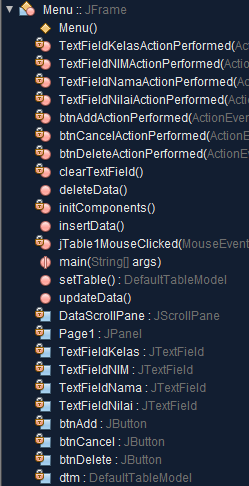
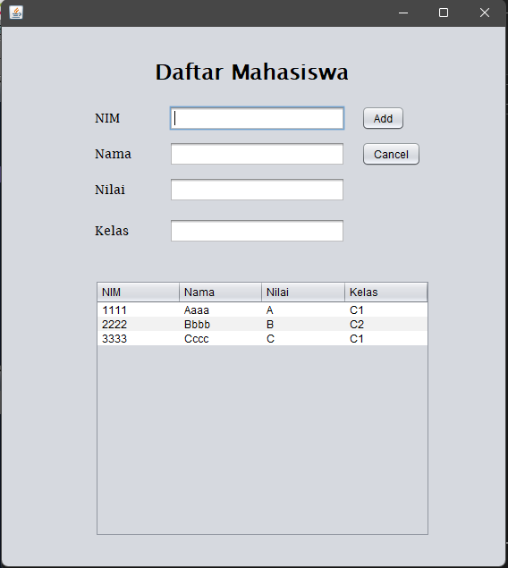
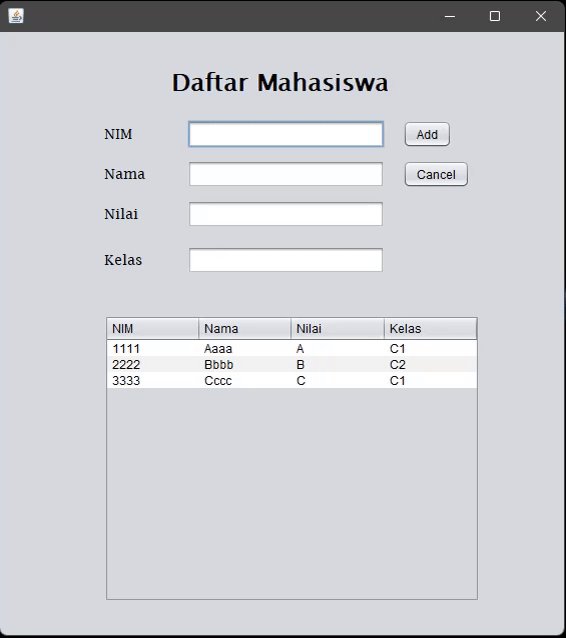
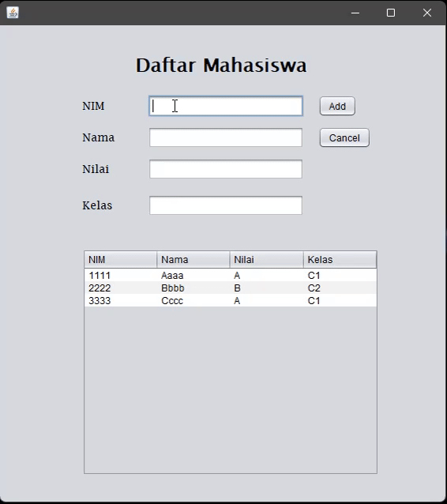
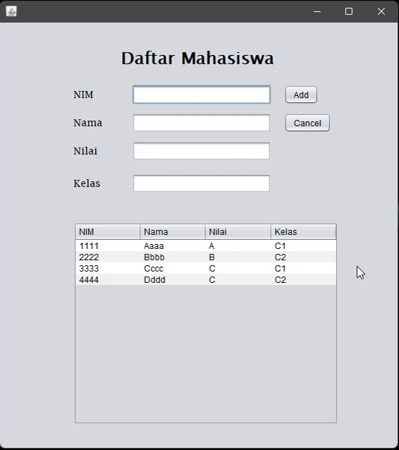
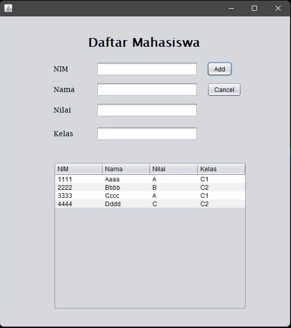
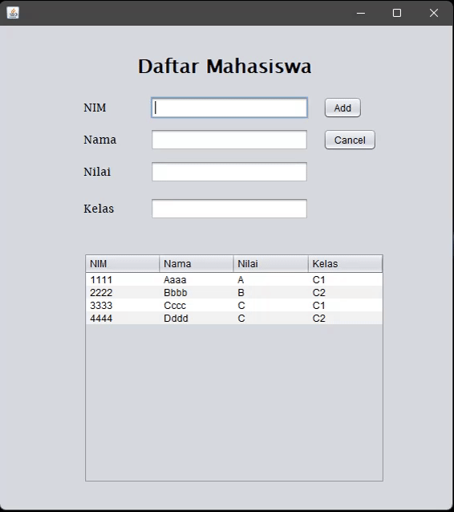

## LATIHAN5DPBO2022

Janji

>Saya Nelly Joy Christi Simanjuntak 2000199 mengerjakan Latihan 5 dalam mata kuliah Desain dan Pemrograman Berorientasi Objek untuk keberkahanNya maka saya tidak melakukan kecurangan seperti yang telah dispesifikasikan. Aamiin

#### Latihan 5 - Java GUI
Pada tugas ini terdapat file jar (didalam folder 'build_result_jar') yang merupakan hasil tugas yang telah saya kerjakan. Untuk source code juga dilampirkan pada folder 'DaftarMahasiswa_JavaSourceCode' yang sudah di build dengan file .jar yang berada dalam folder 'dist'. Berikut penjelasan mengenai apa yang telah saya kerjakan beserta dokumentasi hasilnya.

1. Font telah diubah jenis dan ukurannya menjadi 'Lucida, 14', untuk hasil dapat dilihat pada poin 3.
2. Id setiap komponen telah diubah sesuai kegunaan/fungsinya. 
   
3. Berikut hasil tampilan program dimana terdapat atribut yang ditambahkan, yaitu atribut kelas. Terlihat juga bahwa font telah diubah dan telah ditambahkan kolom untuk menampilkan atribut kelas.
   
4. Terdapat 4 perintah yaitu add, update, delete, dan cancel. Pada semua perintah tersebut telah dibuat validation form berupa pop-up massage, setelah setiap perintah juga text field dibersihkan, dan ketika data pada tabel diklik akan muncum button 'update' dan 'delete'. Berikut beberapa dokumentasi perintah yang telah dilakukan.
   - Perintah 'add', dimana setelah data ditambahkan text field dibersihkan dan table di update. 
     
   - Perintah 'cancel', dimana setelah dicancel text field akan dibersihkan. 
     
   - Perintah 'update', dimana jika data pada table diklik, maka perintah add menjadi update, dan data yang diklik akan muncul pada textfield sehingga dapat diubah. Setelah tombol diklik, text field dibersihkan dan table diupdate. 
     
   - Perintah 'delete'. dimana jika data pada tabel diklik, maka perintah delete muncul dan setelah diklil tombol delete, maka data text field dibersihkan dan tabel duipdate. 
     
5. Validation, ketika salah satu field kosong dan ada perintah yang diklik (update, add, dan delete), maka akan puncul pesan pop-up yang memberitahu field mana yang belum diisi. 
   
   

###### Sekian tugas saya, mohon maaf apabila masih terdapat banyak kesalahan atau kekurangan. Terima kasih.
